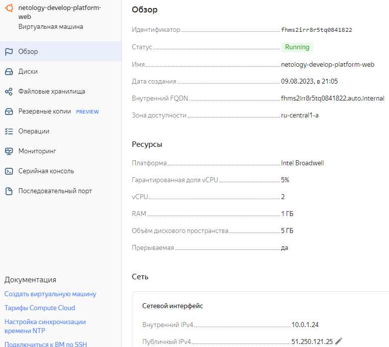
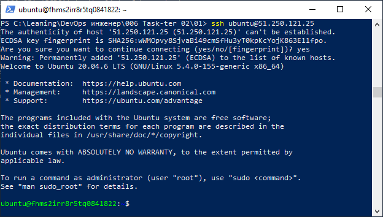
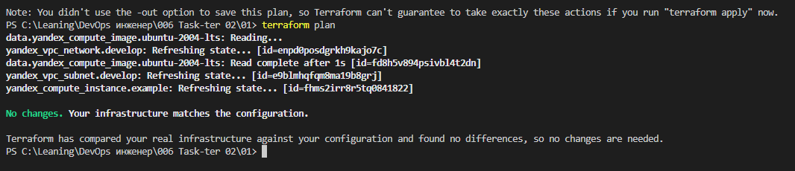
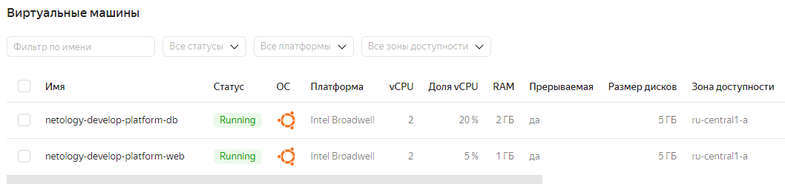
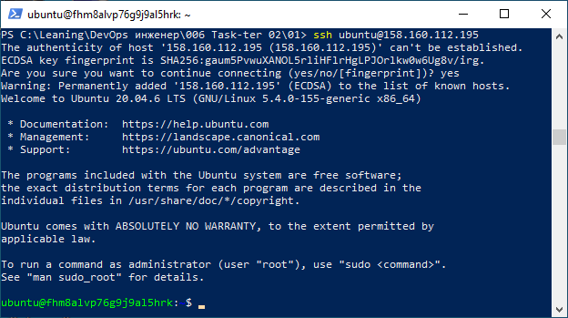
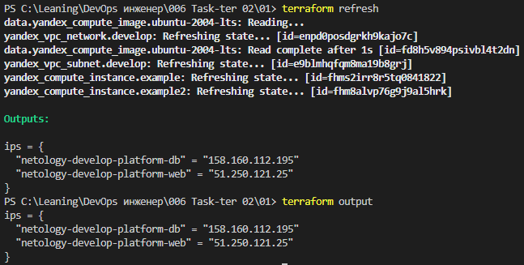
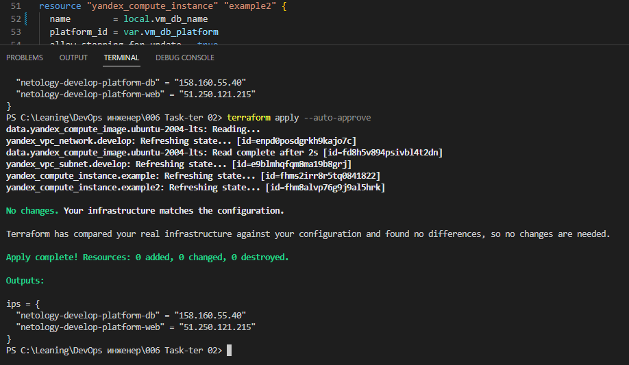
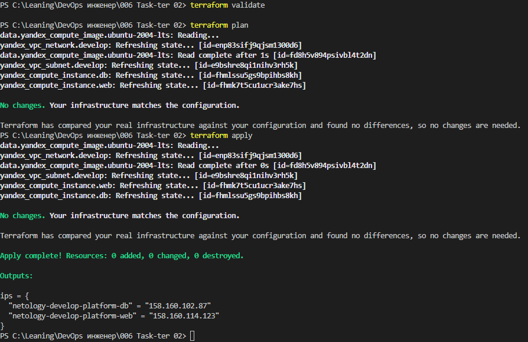
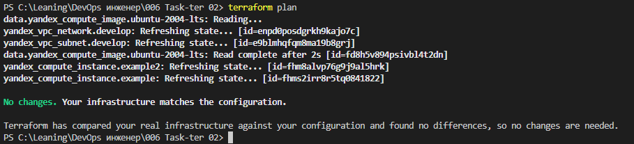
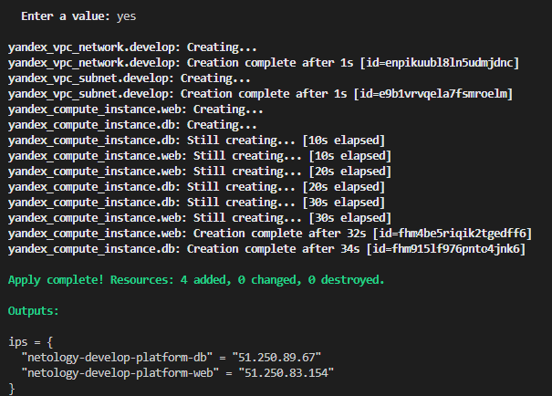

# Задание 1
В качестве ответа всегда полностью прикладывайте ваш terraform-код в git.

1. Изучите проект. В файле variables.tf объявлены переменные для Yandex provider.
2. Переименуйте файл personal.auto.tfvars_example в personal.auto.tfvars. Заполните переменные: идентификаторы облака, токен доступа. Благодаря .gitignore этот файл не попадёт в публичный репозиторий. **Вы можете выбрать иной способ безопасно передать секретные данные в terraform.**
3. Сгенерируйте или используйте свой текущий ssh-ключ. Запишите его открытую часть в переменную **vms_ssh_root_key**.
4. Инициализируйте проект, выполните код. Исправьте намеренно допущенные синтаксические ошибки. Ищите внимательно, посимвольно. Ответьте, в чём заключается их суть.
5. Ответьте, как в процессе обучения могут пригодиться параметры ```preemptible = true``` и ```core_fraction=5``` в параметрах ВМ. Ответ в документации Yandex Cloud.

В качестве решения приложите:

- скриншот ЛК Yandex Cloud с созданной ВМ;
- скриншот успешного подключения к консоли ВМ через ssh. К OS ubuntu необходимо подключаться под пользователем ubuntu: "ssh ubuntu@vm_ip_address";
- ответы на вопросы.

# Решение 1

## Cкриншот ЛК Yandex Cloud с созданной ВМ:



## Cкриншот успешного подключения к консоли ВМ через ssh



## Суть ошибок
1. тип ```object``` требует указания атрибутов объекта с типами их значений
2. тип ```tuple``` представляет собой список значений соответствующих типов из объявления кортежа, заключенных в квадратные скобки
3. значения атрибутов  должны начинаться с новой строки, а не разделяться запятыми 

## Причины использования ```preemptible = true``` и ```core_fraction=5```

```preemptible``` позволяет создать вытесняемую машину, которая будет работать в случае наличия избыточных ресурсов. Такие машины хороши для дополнительной обработки пакетных заданий. Основной плюс - они дешевле стандартных ВМ и могут забрать часть повышенной нагрузки.

```core_fraction=5```  позволяет указать на сколько может ВМ использовать выделенное ей процессорное время в процентах(от 0 до 100)


# Задание 2

1. Изучите файлы проекта.
2. Замените все хардкод-**значения** для ресурсов **yandex_compute_image** и **yandex_compute_instance** на **отдельные** переменные. К названиям переменных ВМ добавьте в начало префикс **vm_web_** .  Пример: **vm_web_name**.
2. Объявите нужные переменные в файле variables.tf, обязательно указывайте тип переменной. Заполните их **default** прежними значениями из main.tf. 
3. Проверьте terraform plan. Изменений быть не должно. 

# Решение 2

В результате изменений и выполнения команды ```terraform plan``` получаем следующего вида вывод:


# Задание 3

1. Создайте в корне проекта файл 'vms_platform.tf' . Перенесите в него все переменные первой ВМ.
2. Скопируйте блок ресурса и создайте с его помощью вторую ВМ в файле main.tf: **"netology-develop-platform-db"** ,  cores  = 2, memory = 2, core_fraction = 20. Объявите её переменные с префиксом **vm_db_** в том же файле ('vms_platform.tf').
3. Примените изменения.

# Решение 3

## Cкриншот ЛК Yandex Cloud со списком созданных ВМ:



## Cкриншот успешного подключения к консоли второй ВМ(netology-develop-platform-db) через ssh



# Задание 4

1. Объявите в файле outputs.tf output типа map, содержащий { instance_name = external_ip } для каждой из ВМ.
2. Примените изменения.

В качестве решения приложите вывод значений ip-адресов команды ```terraform output```.

# Решение 4



# Задание 5

1. В файле locals.tf опишите в **одном** local-блоке имя каждой ВМ, используйте интерполяцию ${..} с несколькими переменными по примеру из лекции.
2. Замените переменные с именами ВМ из файла variables.tf на созданные вами local-переменные.
3. Примените изменения.


# Решение 5
В файле locals.tf описаны переменные с именами машин:
   > locals { \
   >    vm_web_name="netology-${var.vpc_name}-platform-web" \
   >    vm_db_name="netology-${var.vpc_name}-platform-db" \ 
   >    ...
   > } 
   Имена машин созданы как интерполяция входной переменной ```vpc_name```

Файле main.tf в блоках отвечающих за инициализацию ВМ **web** и **db** использованы локальные переменные для задания имен этих ВМ:
> resource "yandex_compute_instance" "web" { \
>    name        = local.vm_web_name \
>    ... \
> } \
> resource "yandex_compute_instance" "db" { \
>    name        = local.vm_db_name \
>    ... \
> } 

### Результат развертывания (изменений нет):



### Результат развертывания после корректировки (изменений нет):



# Задание 6

1. Вместо использования трёх переменных  ".._cores",".._memory",".._core_fraction" в блоке  resources {...}, объедините их в переменные типа **map** с именами "vm_web_resources" и "vm_db_resources". В качестве продвинутой практики попробуйте создать одну map-переменную **vms_resources** и уже внутри неё конфиги обеих ВМ — вложенный map.
2. Также поступите с блоком **metadata {serial-port-enable, ssh-keys}**, эта переменная должна быть общая для всех ваших ВМ.
3. Найдите и удалите все более не используемые переменные проекта.
4. Проверьте terraform plan. Изменений быть не должно.

# Решение 6

 Все статические переменные вынесены в input-переменные:
   > variable "vms_resources"{ 
   >  type = map
   >  default={
   >     web={  
   >         cores  = 2
   >         memory = 1 
   >         core_fraction = 5
   >     }
   >     db={
   >         cores  = 2
   >         memory = 2 
   >         core_fraction = 20
   >     }
   >   }
   > }
   > 
   > variable   "vms_metadata"   {
   >  type = map
   >  default = {} 
   > }
В результате в ```main.tf``` получилось(вместо local используются input-переменные)
1. Для веб-сервера:
   > resources{ \
   >  cores  = var.vms_resources.web.cores \
   >  memory = var.vms_resources.web.memory  \
   >  core_fraction = var.vms_resources.web.core_fraction \
   > } 
2. Для сервера БД:
   > resources { \
   >  cores=var.vms_resources.db.cores \
   >  memory=var.vms_resources.db.memory \
   >  core_fraction=var.vms_resources.db.core_fraction \
   > }
3. А также используется общая для обоих ВМ input-переменная ```vms_metadata```
   > metadata = var.vms_metadata


### Результат выполнения ```terraform plan```(в прошлый раз):



### Результат переразворачивания ВМ после изменений(```terraform destroy+terraform apply```):




